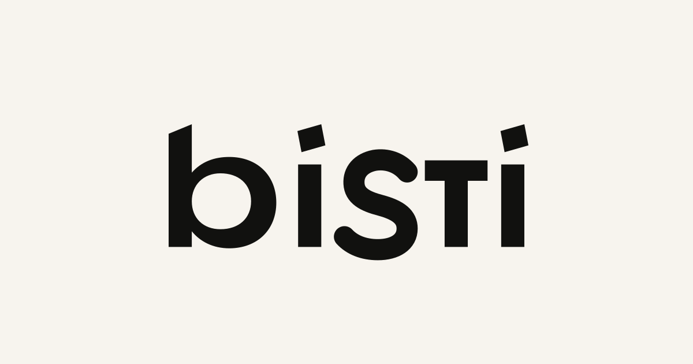

  <picture>
    <source media="(prefers-reduced-motion: reduce)" srcset="./assets/bisti-chromatic-wardrobe-poster.png">
    
  </picture>

<h1 align="center">Bisti</h1>

  <strong>Style you wear. Culture you carry.</strong>

  Bisti takes its name from Kriolu spoken in Cabo Verde:
  <em>bisti</em> means getting dressed.
  We’re building tools to explore looks, keep references,
  and shape a personal wardrobe.

